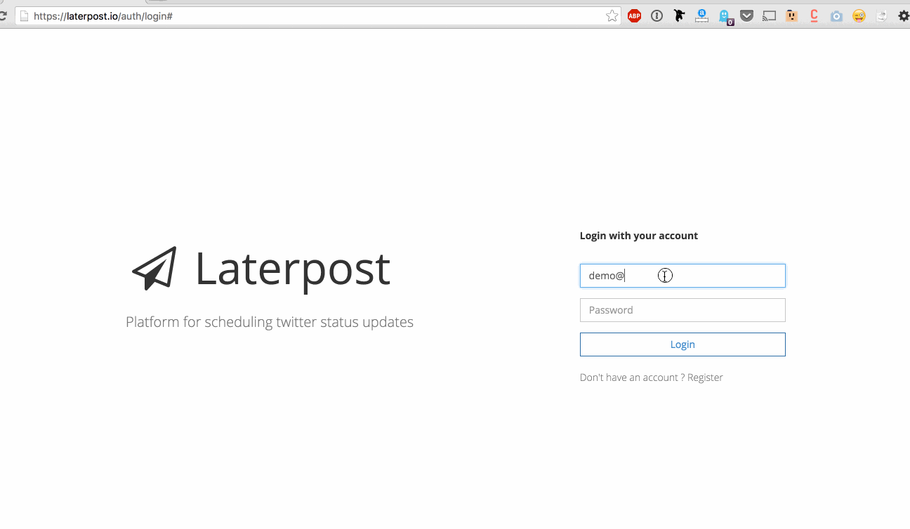
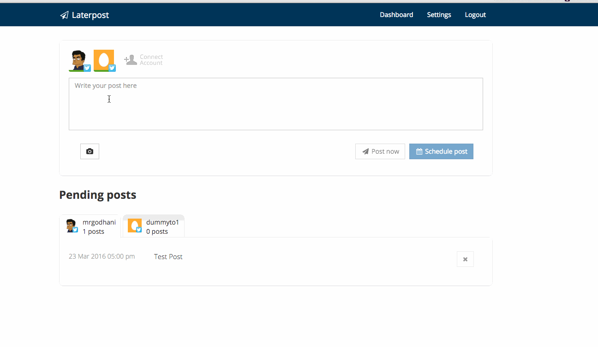

Laterpost (NOT MAINTAINED ANYMORE)
==============

Open source platform for scheduling twitter status updates.

## Installation

### Step 1: Clone the repo
```
git clone https://github.com/mrgodhani/laterpost
```

### Step 2: Prerequisites
This will install the dependencies of this website. It will pull in several packages like Lumen Framework, Vue, Vueify, vue-router, gulp and Laravel Elixir (this is just magic syntactical sugar for gulp, basically).
```
composer install
php artisan migrate
php artisan jwt:secret
npm install
```

### Step 3: Run Gulp
```
gulp --production
```

### Step 4: Configure environment variables
Configure environment variables and add keys for Twitter. Just copy .env.example file by executing command cp .env.example .env . In my case I used Amazon S3 for temporary storing uploaded images. But please free feel to use any driver you want.

```
TWITTER_CLIENT_ID=
TWITTER_CLIENT_SECRET=
TWITTER_CLIENT_CALLBACK=

BITLY_KEY=
BITLY_SECRET=
BITLY_REDIRECT_URI=

AMAZON_KEY=
AMAZON_SECRET=
AMAZON_BUCKET=
AMAZON_REGION=

```

### Step 5: Serve
```
php artisan serve
```

For scheduling posts and queues setup cronjob  as following:

```
* * * * * php /path/to/artisan schedule:run >> /dev/null 2>&1
```

You also have to setup queue driver in your .env file and also configure supervisor to run worker to watch that specific tube.

```
QUEUE_DRIVER=beanstalkd

Configuring supervisor example:

[program:laravel-worker]
process_name=%(program_name)s_%(process_num)02d
command=php /home/forge/app.com/artisan queue:work beanstalkd --sleep=3 --tries=3 --daemon
autostart=true
autorestart=true
user=forge
numprocs=8
redirect_stderr=true
stdout_logfile=/home/forge/app.com/worker.log

```


## Features

- [x] Multi account for twitter
- [x] Email and password login
- [x] Scheduling twitter status updates to multiple account
- [x] Managing connected social media accounts and other account settings (i.e password change, timezone change and email update)
- [x] Sending twitter update with image (Currently supports 1 image upload only)
- [x] Character counting similar to twitter
- [x] Editing scheduled tweets
- [x] URL Shorterner feature (bit.ly integration)
- [ ] Multi image upload
- [ ] Slack integration to notify user when all pending scheduled queues are empty.
- [ ] Integrating Facebook

Linkedin apparently cannot be integrated because of limitation of API availability.

## Demo and Live application




## Support / Contribution

Please feel free to give suggestion or report bug by [creating issue](https://github.com/mrgodhani/rss-reader/issues) or letting me know on twitter [@mrgodhani](https://twitter.com/mrgodhani).
